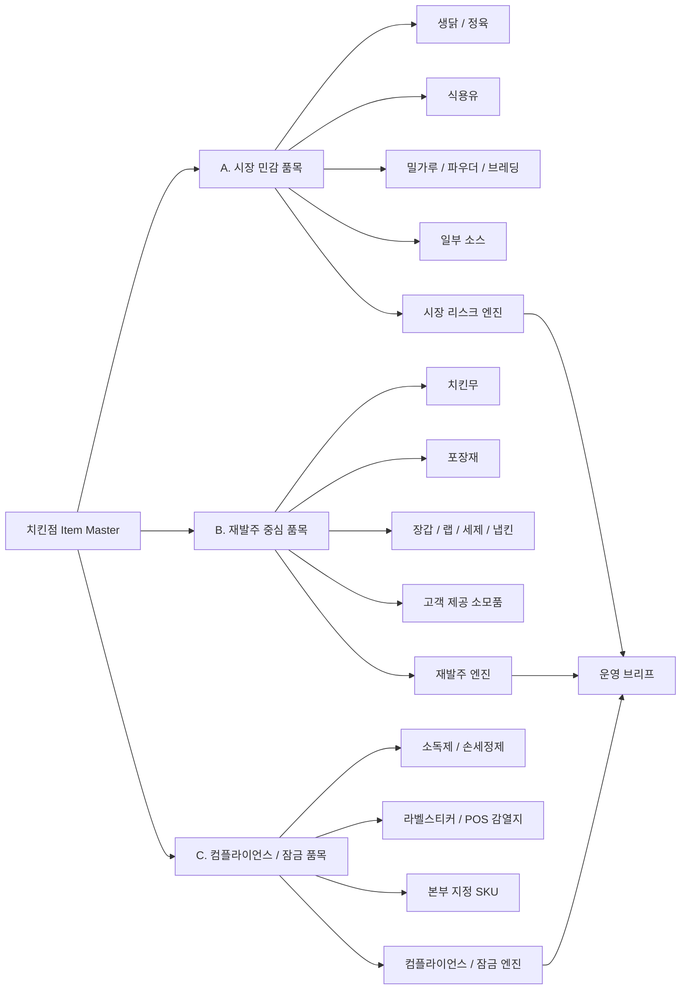
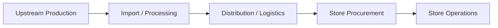
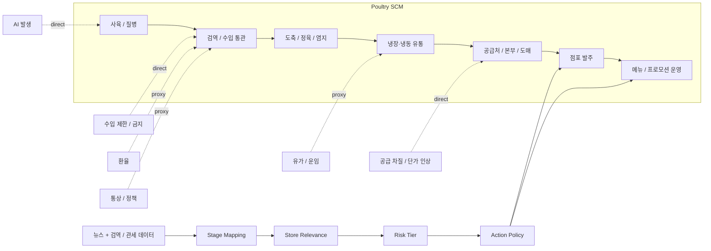
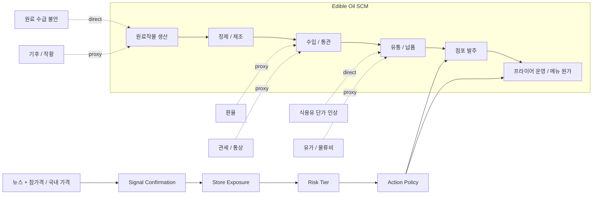
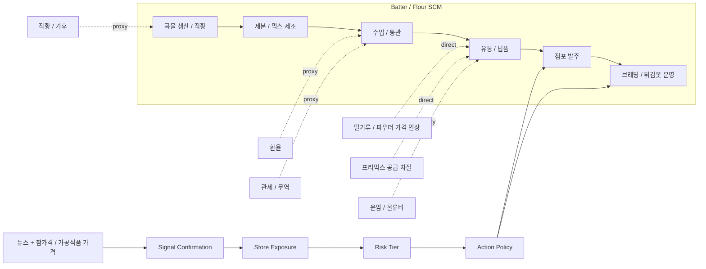
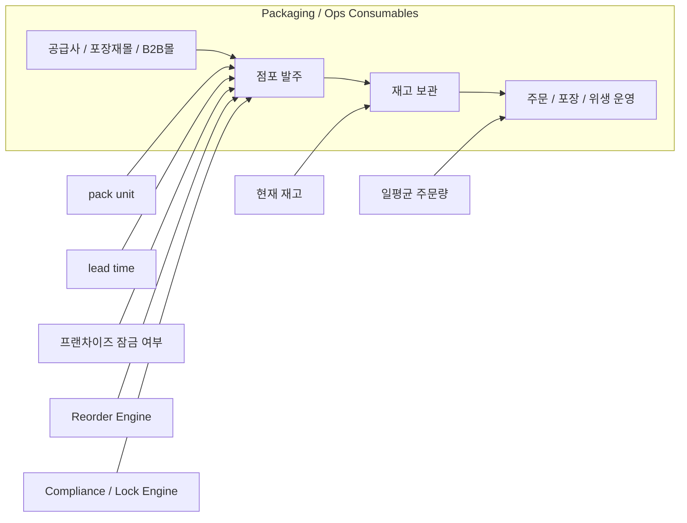
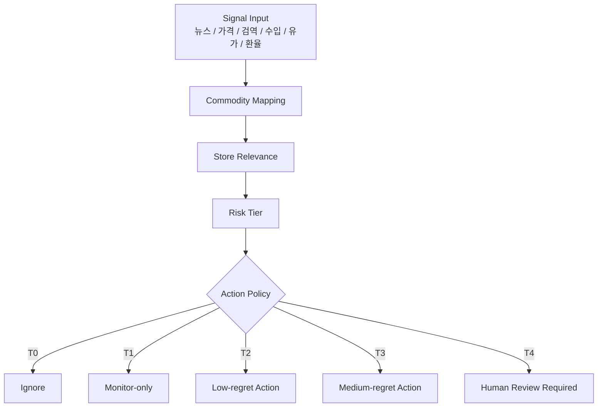
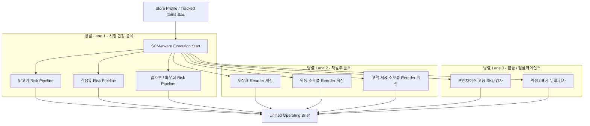
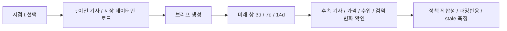

# 사장님 리스크 레이더 - SCM 및 서비스 작동 그래프

> 이 문서는 **SCOR-lite reference model**을 치킨 업종에 맞게 단순화해, 실제 서비스가 어떤 공급망 단계와 어떤 신호를 연결하는지 시각적으로 보여준다.

---

## 1. 품목군별 엔진 선택 그래프

### 해석
- 모든 품목을 뉴스 기반으로 처리하지 않는다.
- **시장 민감 품목만** 뉴스 + 국내 시장 데이터 + 점주 프로필을 쓴다.
- 포장재/소모품은 뉴스보다 **소진속도 / 리드타임 / pack unit**이 더 중요하다.

---

## 2. 치킨점 핵심 SCM 단계 정의

### 각 단계 의미
- **Upstream Production**: 사육, 작황, 질병, 원료 생산
- **Import / Processing**: 수입, 검역, 통관, 도축, 정제, 제분, 제조
- **Distribution / Logistics**: 냉장·냉동유통, 도매, 납품, 공급처, 본부
- **Store Procurement**: 점주의 발주, 리드타임, 재고, 대체 공급처
- **Store Operations**: 메뉴 운영, 프로모션, 포장, 위생, 고객 제공 소모품

---

## 3. 닭고기 SCM 그래프 + 서비스 체크포인트

### 서비스 의미
- direct signal: `AI 발생`, `수입 금지`, `브라질산 닭고기 제한`, `공급 차질`
- proxy signal: `환율`, `운임`, `유가`, `통상 리스크`
- 점주 행동은 주로 `P6 발주`와 `P7 운영` 단계에서 발생한다.

---

## 4. 식용유 SCM 그래프 + 서비스 체크포인트

### 서비스 의미
- 식용유는 닭고기보다 **proxy signal 비중**이 높다.
- 따라서 `proxy-only`일 경우 기본 정책은 `monitor-only` 또는 `low-regret action`이다.

---

## 5. 밀가루 / 파우더 / 브레딩 SCM 그래프

### 서비스 의미
- 파우더/브레딩은 **메뉴 식감과 표준화**에 영향을 주므로, 가격보다 `브랜드 변경 리스크`가 더 클 수 있다.
- 프랜차이즈면 대체 자유도가 낮으므로 `Action Policy`에서 자동 대체 추천을 금지할 수 있다.

---

## 6. 포장재 / 운영 소모품 SCM 그래프

이 품목군은 뉴스보다 **재고와 리드타임**이 중심이다.

### 대상 품목
- 치킨박스, 유산지, 소스컵, 배달봉투, 봉인스티커
- 장갑, 랩, 세제, 소독제, 손세정제, 쓰레기봉투
- 냅킨, 물티슈, 핸드타월, 젓가락, POS 감열지

### 핵심 의미
- 이 품목군은 **기사 리스크가 아니라 재발주 리스크**로 봐야 한다.
- 뉴스 엔진이 아니라 `days_of_cover`, `reorder_point`, `pack_unit rounding`으로 처리한다.

---

## 7. 실제 서비스용 Signal → Relevance → Risk Tier → Action 그래프

### 정책 연결 원칙
- **T0 Ignore**: false positive, relevance 낮음
- **T1 Monitor-only**: proxy-only, stale, ambiguous
- **T2 Low-regret**: 공급처 문의, 재고 점검, shortlist 확인
- **T3 Medium-regret**: 발주 시점 당김 검토, 프로모션 강도 완화, 메뉴 믹스 조정 검토
- **T4 Human Review**: 가격 인상, 대량 선발주, 공급처 전면 전환 같은 high-regret 행동

---

## 8. 서비스 작동 과정에서 병렬 처리 가능한 SCM 구간

### 병렬 설계 원칙
- 품목군이 다르면 계산 입력이 달라 **독립 worker**로 분리하기 좋다.
- 닭고기/식용유/밀가루는 개별 commodity lane으로 나눌 수 있다.
- 포장재/위생품은 LLM 없이 rule engine만으로 계산 가능하다.
- 최종 병합은 `Unified Operating Brief`에서만 일어난다.

---

## 9. Replay / Walk-forward 평가 그래프

### 평가 의미
- `T1`에서 **시계열 누수 금지**
- `T2`에서 당시 시점 정책 생성
- `T4`는 사후 결과 확인용이며, 생성 입력에 다시 쓰면 안 됨

---

## 10. SCM 그래프 문서 사용법

- 치킨 업종 핵심 원재료 리스크를 논의할 때는 `3, 4, 5번 그래프`
- 포장재/소모품 설계는 `6번 그래프`
- 정책 테이블과 운영 경계는 `7번 그래프`
- 병렬 실행 구조는 `8번 그래프`
- 백테스트 설계는 `9번 그래프`
